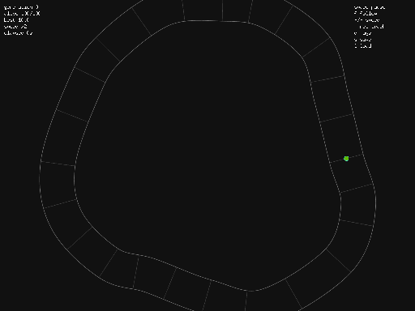
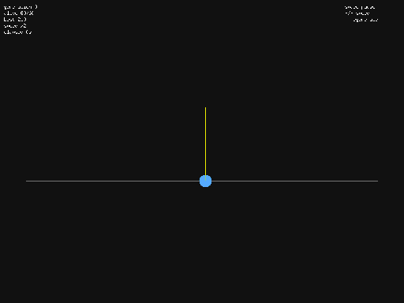
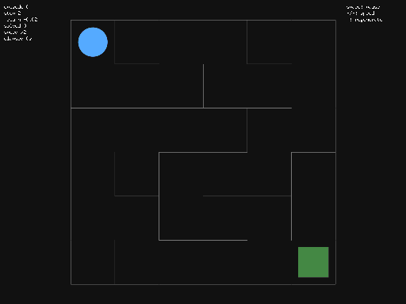
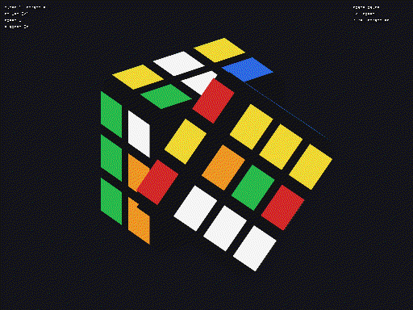

# Demos

Each GUI tool, recorded straight from the Ebiten window (`--record` captures the
screen to an animated GIF). Regenerate them all with `just demos` on a machine
with a display, or run any single command below.

## Racing — a population learning the racing line

A genetic-algorithm population of cars evolves to drive a procedurally generated
track; the leader is highlighted and the fitness sparkline climbs each generation.



```sh
go run -tags ebiten ./cmd/galapagos race --record docs/demos/race.gif --seed 7
```

## Cart-pole — a GA swarm balancing the pole

The same genetic algorithm runs the classic control task as a swarm of carts,
keeping their poles upright.



```sh
go run -tags ebiten ./cmd/galapagos cartpole --agent ga --record docs/demos/cartpole.gif --seed 7
```

## Maze — tabular Q-learning finding the exit

A tabular Q-learning agent learns to reach the goal of a generated maze.



```sh
go run -tags ebiten ./cmd/galapagos maze --agent qlearning --record docs/demos/maze.gif --seed 7
```

## Cube — EfficientCube solving a scrambled cube in 3D

A neural policy trained by self-supervision solves a scrambled cube: it predicts the
move that reverses each scramble step, then finds a solution with beam search and
plays it back on a solid, rotating 3D cube (rendered via the rubix engine).



```sh
go run -tags ebiten ./cmd/galapagos cube --record docs/demos/cube.gif --seed 7
```
